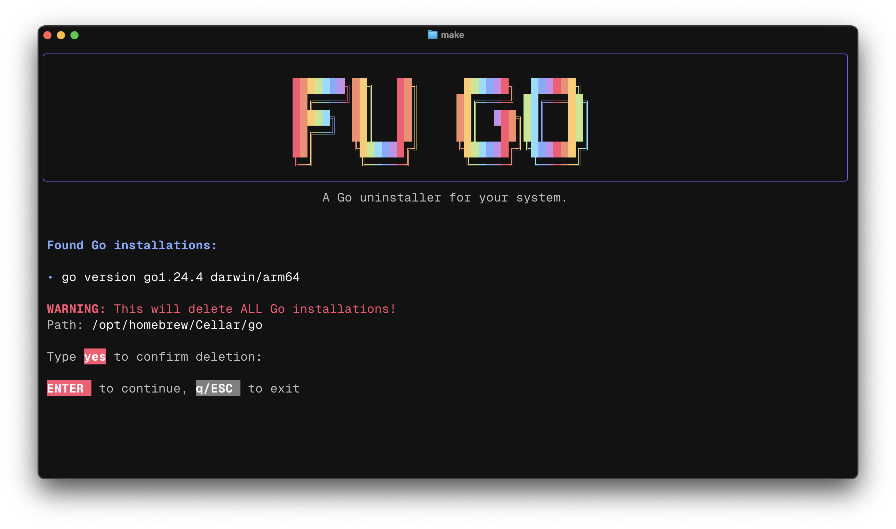

# FU-GO-RS 🦀 - Go Uninstaller (Rust Implementation)

⚠️ **USE AT YOUR OWN RISK!** 

 This tool will attempt to remove Go installations from your system, which could potentially cause issues or remove files you didn't intend to delete. The authors are not responsible for any damage, data loss, or system issues that may result from using this software. Please ensure you have backups and understand the risks before proceeding.




## 🎯 About

**fu-go-rs** is a Rust port of the original [fu-go](https://github.com/Melkeydev/fu-go.git) project by [Melkeydev](https://github.com/Melkeydev). Inspired by Melky's [YouTube video](https://www.youtube.com/watch?v=u4PLJVVHx9U), this project brings the same functionality to the Rust ecosystem with additional improvements and cross-platform support.

Are you frustrated with Go and want to completely remove it from your system? This TUI (Terminal User Interface) application provides a safe and efficient way to uninstall all Go installations from your machine.

## ✋ Original Credit

This project is heavily inspired by and based on:
- **Original Project**: [fu-go](https://github.com/Melkeydev/fu-go.git) by Melkeydev
- **YouTube Video**: [Watch the original video](https://www.youtube.com/watch?v=u4PLJVVHx9U)
- **Concept**: Created as a humorous take on Go uninstallation

## ✨ Features

- 🔍 **Smart Detection**: Automatically finds Go installations across multiple locations
- 🖥️ **Beautiful TUI**: Clean, colorful terminal interface built with [ratatui](https://github.com/ratatui-org/ratatui)
- 🦀 **Rust Performance**: Memory-safe and blazingly fast
- 🛡️ **Safety First**: Multiple confirmation steps and permission checks
- 🍺 **Homebrew Support**: Enhanced detection for Apple Silicon and Intel Macs
- 🎯 **GVM Support**: Detects and removes Go Version Manager installations
- ⚡ **Async Operations**: Non-blocking UI with async file operations
- 🎨 **Modern UI**: Gradient logo, smooth animations, and intuitive controls

## 🚀 Installation

### Prerequisites

- Rust toolchain (install from [rustup.rs](https://rustup.rs/))

### Build from Source

```bash
# Clone the repository
git clone https://github.com/yourusername/fu-go-rs.git
cd fu-go-rs

# Build in release mode
cargo build --release

# Run the application
./target/release/fu-go-rs
```

### Development Build

```bash
# For development/testing
cargo run
```

## 🎮 Usage

1. **Launch** the application:
   ```bash
   ./target/release/fu-go-rs
   ```

2. **Detection Phase**: The app will automatically scan for Go installations

3. **Review**: Check the detected Go versions and installation paths

4. **Confirm**: Type `yes` when prompted to confirm deletion

5. **Complete**: The application will safely remove all Go installations

### Controls

- **Type text**: Enter confirmation text
- **`ENTER`**: Confirm action (when in confirmation state)
- **`q/ESC`**: Quit the application
- **`Ctrl+C`**: Force quit
- **`Backspace`**: Delete characters in input field

## 🔍 Detection Strategy

The application searches for Go installations in the following locations:

### macOS
- `/usr/local/go` (Manual installations)
- `/usr/local/Cellar/go` (Homebrew on Intel Macs)
- `/opt/homebrew/Cellar/go` (Homebrew on Apple Silicon Macs)
- `$HOME/.gvm/gos/*` (Go Version Manager)

### Windows
- `%USERPROFILE%/go`
- `%ProgramFiles%/Go`
- `$HOME/.gvm/gos/*` (Go Version Manager)

### Linux
- `/usr/local/go`
- `/opt/go`
- `/usr/go`
- `$HOME/go`
- `$HOME/.go`
- `$HOME/.gvm/gos/*` (Go Version Manager)

## 🛡️ Safety Measures

- **Permission Checks**: Verifies write permissions before attempting deletion
- **Explicit Confirmation**: Requires typing "yes" to proceed
- **Clear Warnings**: Displays what will be deleted and from where
- **Graceful Failures**: Handles errors without crashing
- **Path Validation**: Confirms paths exist before deletion attempts

## 🏗️ Architecture

The project is structured as follows:

```
src/
├── main.rs           # Application entry point and event loop
├── app.rs            # Application state management
├── tui/              # Terminal User Interface
│   ├── mod.rs        # TUI initialization and restoration
│   └── ui.rs         # UI rendering and layout
└── util/             # Utility modules
    ├── mod.rs        # Module declarations
    ├── go_finder.rs  # Go installation detection
    └── go_deleter.rs # Go installation removal
```

### Key Technologies

- **[ratatui](https://github.com/ratatui-org/ratatui)**: Modern TUI framework
- **[crossterm](https://github.com/crossterm-rs/crossterm)**: Cross-platform terminal manipulation
- **[tokio](https://tokio.rs/)**: Async runtime for non-blocking operations
- **[thiserror](https://github.com/dtolnay/thiserror)**: Ergonomic error handling

## 🤝 Contributing

Contributions are welcome! Please check out [CONTRIBUTING.md](CONTRIBUTING.md) for guidelines.

### Development Setup

See [SETUP.md](SETUP.md) for detailed development setup instructions.

## 📜 Code of Conduct

This project adheres to the [Code of Conduct](CODE_OF_CONDUCT.md). By participating, you are expected to uphold this code.

## 📝 License

This project is licensed under the MIT License - see the [LICENSE](LICENSE) file for details.

## 🙏 Acknowledgments

- **Melkeydev** for the original [fu-go](https://github.com/Melkeydev/fu-go.git) concept and implementation
- The **Rust community** for excellent crates and tooling
- **ratatui** contributors for the amazing TUI framework

## ⚠️ Final Warning

This tool is designed to completely remove Go from your system. Make sure you:
- Have backups of any important data
- Understand what the tool will delete
- Are prepared to reinstall Go if needed
- Have tested the tool in a safe environment first

**Stay single, stay Rust! 🦀**